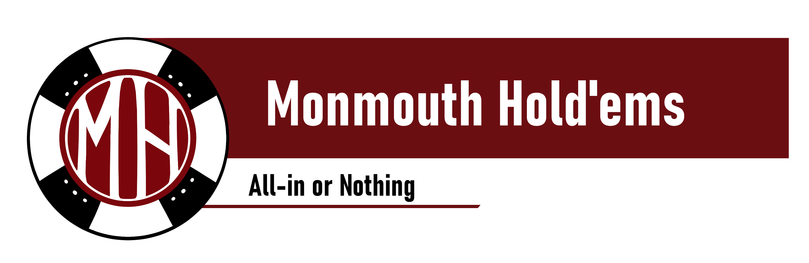

# Monmouth Hold'em Capstone Official Project Repo

The official project repo for the 2026 Monmouth Hold'em Capstone project, created for Western Oregon University's Academic Excellence Showcase 2026 and as part of graduation requirements for the WOU Computer Science Division class of 2026

## Quick Access Links
- [View our Team and Contacts](./docs/team.md)
- [View our Team Meeting Schedule](./docs/mtg-schd.md)

### App Infrastructure Links
- [View our application plans in our Project Overview Graph](./docs/imgs/project-overview-diagram.jpg)
- [View the tools we will use in our Project Development Stack Graph](./docs/imgs/project-dev-stack-diagram.jpg)

## Root Directory Index

### Documents (docs) Directory
The [docs/](./docs/) directory is the directory for both project and general team documents and resources. See the [docs directory readme](./docs/README.md) for more details.

### Source (src) Directory
The [src/](./src/) directory is the directory containing the source code of the project itself. This is the core of the project and the pride of the Monmouth Hold'em Team. See the [src directory readme](./src/README.md) for more details.
